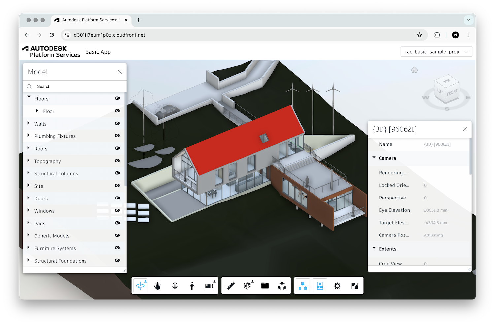

# aps-basic-app-aws

Simple [Autodesk Platform Services](https://aps.autodesk.com) application designed for deployment using the [AWS Serverless Application Model](https://docs.aws.amazon.com/serverless-application-model).

Live demo: https://d301fl7eum1p0z.cloudfront.net

## Development

### Prerequisites

- [APS application credentials](https://forge.autodesk.com/en/docs/oauth/v2/tutorials/create-app)
- [AWS SAM CLI](https://docs.aws.amazon.com/serverless-application-model/latest/developerguide/serverless-sam-cli-install.html)
- [Docker](https://hub.docker.com/search/?type=edition&offering=community)
- [Node.js](https://nodejs.org)
- Command-line terminal such as [PowerShell](https://learn.microsoft.com/en-us/powershell/scripting/overview)
or [bash](https://en.wikipedia.org/wiki/Bash_(Unix_shell)) (should already be available on your system)

### Setup

See [AWS-SAM.md](./AWS-SAM.md).

### Running Locally

See [AWS-SAM.md](./AWS-SAM.md#use-the-aws-sam-cli-to-build-and-test-locally).

### Deployment

See [AWS-SAM.md](./AWS-SAM.md#deploy-the-sample-application).
