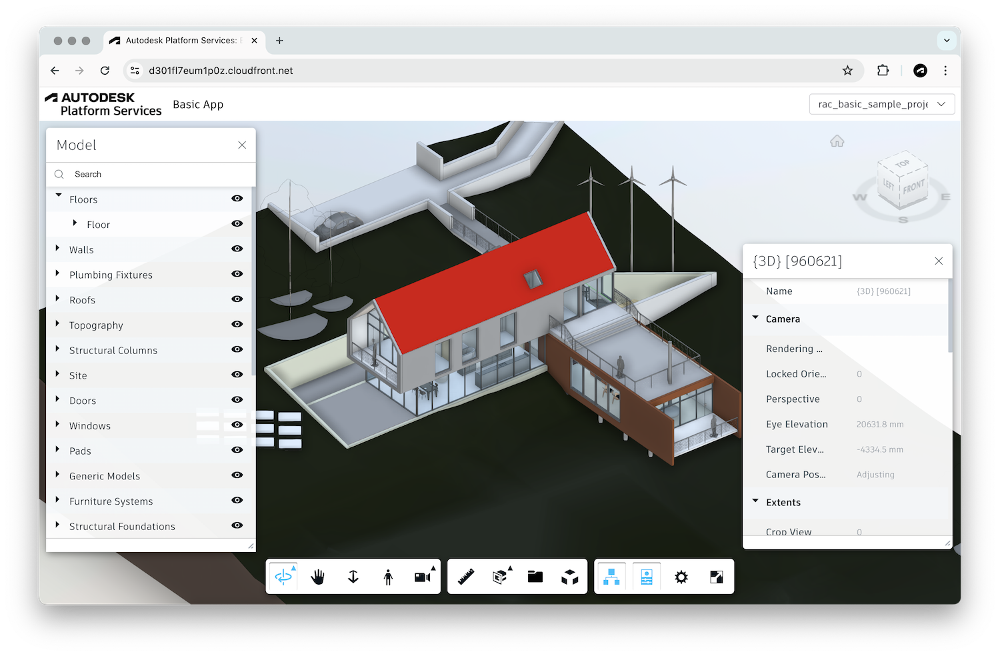

In this tutorial we will build a simple design preview application using [Autodesk Platform Services](https://aps.autodesk.com), and deploy it using [AWS Serverless Application Model](https://docs.aws.amazon.com/serverless-application-model).



# Backend

Let's start by building the backend logic that will later be exposed to our frontend through AWS lambdas and API gateway. Create the following folder structure in your project folder:

```
backend/
  src/
    handlers/
    shared/
```

In this tutorial we will be using Node.js. Create a _package.json_ file under the _backend_ folder with the following content:

```json
{
    "name": "aps-basic-app-aws-backend",
    "version": "0.0.0",
    "private": true,
    "dependencies": {
        "@aps_sdk/authentication": "^0.1.0-beta.1",
        "@aps_sdk/autodesk-sdkmanager": "^0.0.7-beta.1",
        "@aps_sdk/model-derivative": "^0.1.0-beta.1",
        "@aps_sdk/oss": "^0.1.0-beta.1"
    }
}
```

The dependencies listed in the JSON are part of the official [Autodesk Platform Services](https://aps.autodesk.com) SDK for Node.js, and we will use them to access different APIs.

Next, create an _aps.mjs_ file under _backend/src/shared_. This is where we will define helper functions related to APS that will then be reused by our lambdas. Start by adding the following JavaScript code to it:

```js
import { SdkManagerBuilder } from "@aps_sdk/autodesk-sdkmanager";
import { AuthenticationClient, Scopes } from "@aps_sdk/authentication";
import { OssClient, CreateBucketXAdsRegionEnum, CreateBucketsPayloadPolicyKeyEnum } from "@aps_sdk/oss";
import { ModelDerivativeClient, View, Type } from "@aps_sdk/model-derivative";

const PUBLIC_SCOPES = [Scopes.ViewablesRead];
const INTERNAL_SCOPES = [Scopes.BucketRead, Scopes.BucketCreate, Scopes.DataCreate, Scopes.DataWrite, Scopes.DataRead];

const sdk = SdkManagerBuilder.create().build();
const authenticationClient = new AuthenticationClient(sdk);
const ossClient = new OssClient(sdk);
const modelDerivativeClient = new ModelDerivativeClient(sdk);

export async function getPublicAccessToken(clientId, clientSecret) {
    const credentials = await authenticationClient.getTwoLeggedToken(clientId, clientSecret, PUBLIC_SCOPES);
    return credentials;
}

export async function getInternalAccessToken(clientId, clientSecret) {
    const credentials = await authenticationClient.getTwoLeggedToken(clientId, clientSecret, INTERNAL_SCOPES);
    return credentials;
}
```

The `getPublicAccessToken` function generates an access token with very limited capabilities that will be used by the viewer later, and the `getInternalAccessToken` function generates a more powerful access token that we will use for all backend operations, e.g., creating storage buckets or uploading files.

## Getting list of designs

One of the first things our frontend will need is a list of all designs currently available in our application. Let's add a couple of helper functions to the end of _backend/src/shared/aps.mjs_:

```js
export async function ensureBucketExists(bucketKey, accessToken) {
    try {
        await ossClient.getBucketDetails(accessToken, bucketKey);
    } catch (err) {
        if (err.axiosError.response.status === 404) {
            await ossClient.createBucket(accessToken, CreateBucketXAdsRegionEnum.Us, {
                bucketKey: bucketKey,
                policyKey: CreateBucketsPayloadPolicyKeyEnum.Persistent
            });
        } else {
            throw err;  
        }
    }
}

export async function listObjects(bucketKey, accessToken) {
    let resp = await ossClient.getObjects(accessToken, bucketKey, { limit: 64 });
    let objects = resp.items;
    while (resp.next) {
        const startAt = new URL(resp.next).searchParams.get("startAt");
        resp = await ossClient.getObjects(accessToken, bucketKey, { limit: 64, startAt });
        objects = objects.concat(resp.items);
    }
    return objects;
}

export function urnify(id) {
    return Buffer.from(id).toString("base64").replace(/=/g, "");
}
```

The `ensureBucketExists` function will make sure that our application has a bucket to store designs in, the `listObjects` function will return a list of all objects currently stored in the bucket, and the `urnify` function converts object IDs into URNs that will be used by the viewer.

Now we can create a _get-designs.mjs_ file under _backend/src/handlers_ with the following code:

```js
import assert from "assert";
import process from "process";
import { getInternalAccessToken, ensureBucketExists, listObjects, urnify } from "../shared/aps.mjs";

const DEFAULT_HEADERS = {
    "Access-Control-Allow-Headers" : "Content-Type",
    "Access-Control-Allow-Origin": "*",
    "Access-Control-Allow-Methods": "OPTIONS,GET"
};

export async function getDesigns(event) {
    try {
        const { APS_CLIENT_ID, APS_CLIENT_SECRET } = process.env;
        assert(!!APS_CLIENT_ID, "Missing APS_CLIENT_ID environment variable.");
        assert(!!APS_CLIENT_SECRET, "Missing APS_CLIENT_SECRET environment variable.");
        assert(event.httpMethod === "GET", "Only GET requests are allowed for this endpoint.");
        const credentials = await getInternalAccessToken(APS_CLIENT_ID, APS_CLIENT_SECRET);
        const bucketKey = APS_CLIENT_ID.toLowerCase() + "-test-bucket";
        await ensureBucketExists(bucketKey, credentials.access_token);
        const objects = await listObjects(bucketKey, credentials.access_token);
        return {
            statusCode: 200,
            headers: DEFAULT_HEADERS,
            body: JSON.stringify(objects.map(obj => ({
                name: obj.objectKey,
                urn: urnify(obj.objectId)
            })))
        };
    } catch (err) {
        console.error(err);
        return {
            statusCode: 400,
            headers: DEFAULT_HEADERS,
            body: JSON.stringify({ message: err.message })
        };
    }
}
```

We will later configure a `GET /designs` endpoint in the API gateway and a lambda function using this code to provide the list of designs to the frontend.

## Adding new design

Our application will also allow users to upload new designs. Let's add another helper function to the end of _backend/src/shared/aps.mjs_:

```js
export async function createUploadURL(bucketKey, objectKey, accessToken) {
    const signedUrl = await ossClient.createSignedResource(accessToken, bucketKey, objectKey, { access: "write" });
    return signedUrl.signedUrl;
}
```

This utility function creates temporary signed resource URLs that the frontend can use to upload new designs directly to our application's storage bucket.

Next, create a _create-design.mjs_ file under _backend/src/handlers_, and add the following code to it:

```js
import assert from "assert";
import process from "process";
import { getInternalAccessToken, ensureBucketExists, createUploadURL } from "../shared/aps.mjs";

const DEFAULT_HEADERS = {
    "Access-Control-Allow-Headers" : "Content-Type",
    "Access-Control-Allow-Origin": "*",
    "Access-Control-Allow-Methods": "OPTIONS,POST"
};

export async function createDesign(event) {
    try {
        const { APS_CLIENT_ID, APS_CLIENT_SECRET } = process.env;
        assert(!!APS_CLIENT_ID, "Missing APS_CLIENT_ID environment variable.");
        assert(!!APS_CLIENT_SECRET, "Missing APS_CLIENT_SECRET environment variable.");
        assert(event.httpMethod === "POST", "Only POST requests are allowed for this endpoint.");
        const { name } = JSON.parse(event.body);
        assert(name, "The 'name' field is missing in the request payload.");
        const credentials = await getInternalAccessToken(APS_CLIENT_ID, APS_CLIENT_SECRET);
        const bucketKey = APS_CLIENT_ID.toLowerCase() + "-test-bucket";
        await ensureBucketExists(bucketKey, credentials.access_token);
        const url = await createUploadURL(bucketKey, name, credentials.access_token);
        return {
            statusCode: 200,
            headers: DEFAULT_HEADERS,
            body: JSON.stringify({ url })
        };
    } catch (err) {
        console.error(err);
        return {
            statusCode: 400,
            headers: DEFAULT_HEADERS,
            body: JSON.stringify({ message: err.message })
        };
    }
}
```

This logic will later be exposed through a `POST /designs` endpoint, accepting a JSON payload of the following form:

```json
{
    "name": "<new-design-filename>"
}
```

## Checking design status

In order to be able to preview designs in our viewer, we must first process them using the [Model Derivative service](https://aps.autodesk.com/en/docs/model-derivative/v2/developers_guide/overview/). This service is responsible for extracting all sorts of "viewables" or "derivatives" from design files, for example, thumbnails, 2D drawings, or 3D views. Let's add couple more helper functions to the end of _backend/src/shared/aps.mjs_:

```js
export async function getDerivativeManifest(urn, accessToken) {
    try {
        const manifest = await modelDerivativeClient.getManifest(accessToken, urn);
        return manifest
    } catch (err) {
        if (err.axiosError.response.status === 404) {
            return null;
        } else {
            throw err;
        }
    }
}

export async function startDerivativeConversion(urn, accessToken) {
    const job = await modelDerivativeClient.startJob(accessToken, {
        input: {
            urn
        },
        output: {
            formats: [{
                views: [View._2d, View._3d],
                type: Type.Svf2
            }]
        }
    });
    return job.result;
}
```

The `getDerivativeManifest` function will return the current derivative extraction status for a specific design URN (for example, whether the extraction is still in progress, whether it failed, or what viewables were extracted). And in case the design hasn't been processed yet, we also include the `startDerivativeConversion` function that will kick off the derivative extraction process in the background.

Now, create a _get-design-status.mjs_ file under _backend/src/handlers_ with the following code:

```js
import assert from "assert";
import process from "process";
import { getInternalAccessToken, getDerivativeManifest, startDerivativeConversion } from "../shared/aps.mjs";

const DEFAULT_HEADERS = {
    "Access-Control-Allow-Headers" : "Content-Type",
    "Access-Control-Allow-Origin": "*",
    "Access-Control-Allow-Methods": "OPTIONS,GET"
};

export async function getDesignStatus(event) {
    try {
        const { APS_CLIENT_ID, APS_CLIENT_SECRET } = process.env;
        assert(!!APS_CLIENT_ID, "Missing APS_CLIENT_ID environment variable.");
        assert(!!APS_CLIENT_SECRET, "Missing APS_CLIENT_SECRET environment variable.");
        assert(event.httpMethod === "GET", "Only GET requests are allowed for this endpoint.");
        const { urn } = event.pathParameters;
        const credentials = await getInternalAccessToken(APS_CLIENT_ID, APS_CLIENT_SECRET);
        let manifest = await getDerivativeManifest(urn, credentials.access_token);
        // If there are no derivatives yet, kick off a new conversion process in the background
        if (!manifest) {
            await startDerivativeConversion(urn, credentials.access_token);
            manifest = await getDerivativeManifest(urn, credentials.access_token);
        }
        return {
            statusCode: 200,
            headers: DEFAULT_HEADERS,
            body: JSON.stringify(manifest)
        };
    } catch (err) {
        console.error(err);
        return {
            statusCode: 400,
            headers: DEFAULT_HEADERS,
            body: JSON.stringify({ message: err.message })
        };
    }
}
```

This code will also be used by a lambda function to handle an API gateway endpoint: `GET /designs/{urn}/status`.

## Getting viewer token

As we mentioned earlier, if we want the viewer in our web application to load derivatives extracted by the Model Derivative service, we need to supply it with an access token. Create a _get-access-token.mjs_ file under _backend/src/handlers_, and add the following code to it:

```js
import assert from "assert";
import process from "process";
import { getPublicAccessToken } from "../shared/aps.mjs";

const DEFAULT_HEADERS = {
    "Access-Control-Allow-Headers" : "Content-Type",
    "Access-Control-Allow-Origin": "*",
    "Access-Control-Allow-Methods": "OPTIONS,GET"
};

export async function getAccessToken(event) {
    try {
        const { APS_CLIENT_ID, APS_CLIENT_SECRET } = process.env;
        assert(!!APS_CLIENT_ID, "Missing APS_CLIENT_ID environment variable.");
        assert(!!APS_CLIENT_SECRET, "Missing APS_CLIENT_SECRET environment variable.");
        assert(event.httpMethod === "GET", "Only GET requests are allowed for this endpoint.");
        const credentials = await getPublicAccessToken(APS_CLIENT_ID, APS_CLIENT_SECRET);
        return {
            statusCode: 200,
            headers: DEFAULT_HEADERS,
            body: JSON.stringify(credentials)
        };
    } catch (err) {
        console.error(err);
        return {
            statusCode: 400,
            headers: DEFAULT_HEADERS,
            body: JSON.stringify({ message: err.message })
        };
    }
}
```

We will later configure a `GET /token` endpoint in the API gateway and a lambda function using this code so that the viewer can request a new access token whenever it needs one.

# Frontend

Our frontend is a simple single-page application built with vanilla HTML, CSS, and JavaScript. Create a _frontend_ folder in your project folder - this is where we will be storing all the client-side assets.

## Layout

The UI of our app will be simple, with a header at the top (with logo, title, dropdown for model selection, and button for model upload), and the rest of the page being used by the viewer. Create an _index.html_ file under the _frontend_ folder with the following HTML:

```html
<!DOCTYPE html>
<html lang="en">

<head>
    <meta charset="UTF-8">
    <meta name="viewport" content="width=device-width, initial-scale=1.0">
    <link rel="icon" type="image/x-icon" href="https://cdn.autodesk.io/favicon.ico">
    <link rel="stylesheet" href="https://developer.api.autodesk.com/modelderivative/v2/viewers/7.*/style.css">
    <link rel="stylesheet" href="./index.css">
    <title>Autodesk Platform Services: Basic Application</title>
</head>

<body>
    <div id="header">
        
        <span class="title">Basic App</span>
        <select id="models"></select>
        <button id="upload" title="Upload New Model">Upload</button>
        <input style="display: none" type="file" id="input">
    </div>
    <div id="preview"></div>
    <script src="https://developer.api.autodesk.com/modelderivative/v2/viewers/7.*/viewer3D.js"></script>
    <script type="module" src="./index.js"></script>
</body>

</html>
```

Next, create an _index.css_ file in the same folder as _index.html_, and add the following:

```css
body {
    margin: 0;
    padding: 0;
    width: 100vw;
    height: 100vh;
    display: grid;
    grid-template-rows: 3em 1fr;
    grid-template-areas: "header" "preview";
    font-family: ArtifaktElement;
}

#header {
    grid-area: header;
    display: flex;
    flex-flow: row nowrap;
    justify-content: space-between;
    align-items: center;
}

#preview {
    grid-area: preview;
    position: relative;
    overflow: hidden;
}

#header > * {
    margin: 0 0.5em;
    height: 2em;
}

#header .title {
    margin-left: 0.5em;
    margin-right: auto;
    height: auto;
    font-weight: bolder;
}
```

## Viewer utilities

In order to keep our client-side code organized, we will define all our viewer-related logic in a separate file. Create a _viewer.js_ file under the _frontend_ folder, and add the following helper functions to it:

```js
export function initViewer(container, accessTokenEndpoint) {
    const options = {
        env: "AutodeskProduction2",
        api: "streamingV2",
        getAccessToken: async function (callback) {
            try {
                const resp = await fetch(accessTokenEndpoint);
                if (resp.ok) {
                    const credentials = await resp.json();
                    callback(credentials.access_token, credentials.expires_in);                    
                } else {
                    throw new Error(await resp.text());
                }
            } catch (err) {
                console.error(err);
                alert("Could not obtain access token. See the console for more details.");
            }
        }
    };
    return new Promise(function (resolve, reject) {
        Autodesk.Viewing.Initializer(options, function () {
            const viewer = new Autodesk.Viewing.GuiViewer3D(container);
            viewer.start();
            viewer.setTheme("light-theme");
            viewer.setEnvMapBackground(false);
            resolve(viewer);
        });
    });
}

export function loadModel(viewer, urn) {
    function onDocumentLoadSuccess(doc) {
        viewer.loadDocumentNode(doc, doc.getRoot().getDefaultGeometry());
    }
    function onDocumentLoadFailure(code, message, errors) {
        console.error(code, message, errors);
        alert("Could not load design. See the console for more details.");
    }
    Autodesk.Viewing.Document.load("urn:" + urn, onDocumentLoadSuccess, onDocumentLoadFailure);
}
```

The `initViewer` function creates a new instance of the viewer, while also making sure that all its dependencies are available on the client. The `loadModel` function can then be used to start loading individual designs into the viewer.

## Application logic

And finally, let's add the application logic that will tie together the UI and the state of the app. Create an _index.js_ file under the _frontend_ folder with the following code:

```js
import { initViewer, loadModel } from "./viewer.js";
import { API_ENDPOINT } from "./config.js";

const urn = window.location.hash?.substring(1);
const viewer = await initViewer(document.getElementById("preview"), `${API_ENDPOINT}token`);
setupModelSelection(viewer, urn);
setupModelUpload(viewer);

async function setupModelSelection(viewer, selectedUrn) {
    const dropdown = document.getElementById("models");
    dropdown.innerHTML = "";
    try {
        const resp = await fetch(`${API_ENDPOINT}designs`);
        if (!resp.ok) {
            throw new Error(await resp.text());
        }
        const models = await resp.json();
        dropdown.innerHTML = models.map(model => `<option value=${model.urn} ${model.urn === selectedUrn ? "selected" : ""}>${model.name}</option>`).join("\n");
        dropdown.onchange = () => onModelSelected(viewer, dropdown.value);
        if (dropdown.value) {
            onModelSelected(viewer, dropdown.value);
        }
    } catch (err) {
        console.error(err);
        alert("Could not list models. See the console for more details.");
    }
}

async function setupModelUpload(viewer) {
    const upload = document.getElementById("upload");
    const input = document.getElementById("input");
    const models = document.getElementById("models");
    upload.onclick = () => input.click();
    input.onchange = async () => {
        /** @type File */
        const file = input.files[0];
        upload.setAttribute("disabled", "true");
        models.setAttribute("disabled", "true");
        console.log(`Uploading model <code>${file.name}</code>. Do not reload the page.`);
        try {
            // Create a design & get an upload URL
            let resp = await fetch(`${API_ENDPOINT}designs`, {
                method: "POST",
                headers: {
                    "Content-Type": "application/json"
                },
                body: JSON.stringify({ name: file.name })
            });
            if (!resp.ok) {
                throw new Error(await resp.text());
            }
            const { url } = await resp.json();
            // Upload file
            const buffer = await file.arrayBuffer();
            resp = await fetch(url, { method: "PUT", body: buffer });
            if (!resp.ok) {
                throw new Error(await resp.text());
            }
            // Update UI
            setupModelSelection(viewer);
        } catch (err) {
            alert(`Could not upload model ${file.name}. See the console for more details.`);
            console.error(err);
        } finally {
            upload.removeAttribute("disabled");
            models.removeAttribute("disabled");
            input.value = "";
        }
    };
}

async function onModelSelected(viewer, urn) {
    window.location.hash = urn;
    try {
        const resp = await fetch(`${API_ENDPOINT}designs/${urn}/status`);
        if (!resp.ok) {
            throw new Error(await resp.text());
        }
        const status = await resp.json();
        switch (status.status) {
            case "inprogress":
                console.log(`Model is being translated (${status.progress}). Try again later.`);
                break;
            case "failed":
                console.log(`Translation failed. <ul>${status.messages.map(msg => `<li>${JSON.stringify(msg)}</li>`).join("")}</ul>`);
                break;
            default:
                loadModel(viewer, urn);
                break; 
        }
    } catch (err) {
        alert("Could not load model. See the console for more details.");
        console.error(err);
    }
}
```

> Note that the _index.js_ code imports another JavaScript file we have not discussed yet - _config.js_. This file will be auto-generated during the deployment to AWS, and its only purpose is providing the API gateway endpoint of our backend logic.

# Serverless architecture

There are various ways of deploying web applications to AWS. In this tutorial we will be using [AWS Serverless Application Model](https://docs.aws.amazon.com/serverless-application-model). We will create an AWS SAM template file specifying all the different AWS resources (for example, API gateway, lambdas, or S3 buckets) that our application needs, and also how the different parts of our code should be deployed to these resources. Create a _template.yaml_ file in the root of your project, and add the following content to it:

```yaml
# This is the SAM template that represents the architecture of your serverless application
# https://docs.aws.amazon.com/serverless-application-model/latest/developerguide/serverless-sam-template-basics.html

AWSTemplateFormatVersion: 2010-09-09
Description: Autodesk Platform Services application built using AWS serverless.
Transform: AWS::Serverless-2016-10-31

Parameters:
  ClientID:
    Type: String
    Description: APS application client ID.
    Default: ""
  ClientSecret:
    Type: String
    Description: APS application client secret.
    Default: ""

Globals:
  Function:
    Runtime: nodejs18.x
    Timeout: 600
    MemorySize: 1024
    Architectures:
      - x86_64
    Environment:
      Variables:
        APS_CLIENT_ID: !Ref ClientID
        APS_CLIENT_SECRET: !Ref ClientSecret

Resources:
  ApiGatewayApi:
    Type: AWS::Serverless::Api
    Properties:
      StageName: Prod
      Cors:
        AllowMethods: "'OPTIONS, POST, GET'"
        AllowHeaders: "'Content-Type'"
        AllowOrigin: "'*'" # DO NOT USE THIS VALUE IN PRODUCTION - https://docs.aws.amazon.com/apigateway/latest/developerguide/http-api-cors.html

  getAccessTokenFunction:
    Type: AWS::Serverless::Function
    Properties:
      CodeUri: backend/
      Handler: src/handlers/get-access-token.getAccessToken
      Description: Generates an access token for previewing designs in the viewer.
      Events:
        Api:
          Type: Api
          Properties:
            Path: /token
            Method: GET
            RestApiId:
              Ref: ApiGatewayApi

  getDesignsFunction:
    Type: AWS::Serverless::Function
    Properties:
      CodeUri: backend/
      Handler: src/handlers/get-designs.getDesigns
      Description: Lists all designs stored by the application.
      Events:
        Api:
          Type: Api
          Properties:
            Path: /designs
            Method: GET
            RestApiId:
              Ref: ApiGatewayApi

  createDesignFunction:
    Type: AWS::Serverless::Function
    Properties:
      CodeUri: backend/
      Handler: src/handlers/create-design.createDesign
      Description: Creates new design and provides an upload URL for it.
      Events:
        Api:
          Type: Api
          Properties:
            Path: /designs
            Method: POST
            RestApiId:
              Ref: ApiGatewayApi

  getDesignStatusFunction:
    Type: AWS::Serverless::Function
    Properties:
      CodeUri: backend/
      Handler: src/handlers/get-design-status.getDesignStatus
      Description: Returns status of derivative extraction for specific design.
      Events:
        Api:
          Type: Api
          Properties:
            Path: /designs/{urn}/status
            Method: GET
            RestApiId:
              Ref: ApiGatewayApi

  WebSiteBucket:
    Type: "AWS::S3::Bucket"

  WebSiteBucketPolicy:
    Type: "AWS::S3::BucketPolicy"
    Properties:
      Bucket: !Ref WebSiteBucket
      PolicyDocument:
        Version: "2012-10-17"
        Id: "PolicyForCloudFrontPrivateContent"
        Statement:
        - Sid: "AllowCloudFrontServicePrincipal"
          Effect: "Allow"
          Principal:
            Service: "cloudfront.amazonaws.com"
          Action: "s3:GetObject"
          Resource: !Join [ "", [ "arn:aws:s3:::", !Ref WebSiteBucket, "/*" ] ]
          Condition:
            StringEquals:
              "AWS:SourceArn": !Join [ "", [ "arn:aws:cloudfront::", !Ref "AWS::AccountId", ":distribution/", !Ref CloudFrontDistribution ] ]

  CloudFrontDistribution:
    Type: "AWS::CloudFront::Distribution"
    Properties:
      DistributionConfig:
        Origins:
        - DomainName: !GetAtt WebSiteBucket.RegionalDomainName
          Id: "myS3Origin"
          OriginAccessControlId: !GetAtt CloudFrontOriginAccessControl.Id
          S3OriginConfig: 
            OriginAccessIdentity: ""
        Enabled: true
        DefaultRootObject: "index.html"
        HttpVersion: "http2"
        DefaultCacheBehavior:
          AllowedMethods:
          - "DELETE"
          - "GET"
          - "HEAD"
          - "OPTIONS"
          - "PATCH"
          - "POST"
          - "PUT"
          CachedMethods:
          - "GET"
          - "HEAD"
          TargetOriginId: "myS3Origin"
          ForwardedValues:
            QueryString: false
            Cookies:
              Forward: "none"
          ViewerProtocolPolicy: "allow-all"
          MinTTL: 0
          DefaultTTL: 3600
          MaxTTL: 86400
        PriceClass: "PriceClass_200"
        ViewerCertificate:
          CloudFrontDefaultCertificate: true
  CloudFrontOriginAccessControl:
    Type: "AWS::CloudFront::OriginAccessControl"
    Properties:
      OriginAccessControlConfig:
        Name: !Sub "${WebSiteBucket} OAC"
        OriginAccessControlOriginType: "s3"
        SigningBehavior: "always"
        SigningProtocol: "sigv4"

Outputs:
  APIGatewayEndpoint:
    Description: "API Gateway endpoint URL for Prod stage"
    Value: !Sub "https://${ApiGatewayApi}.execute-api.${AWS::Region}.amazonaws.com/Prod/"
  CloudFrontDistributionId:
    Description: "CloudFront Distribution ID for hosting web front end"
    Value: !Ref CloudFrontDistribution
  CloudFrontDistributionDomainName:
    Description: "CloudFront Distribution Domain Name for accessing web front end"
    Value: !GetAtt CloudFrontDistribution.DomainName
  WebS3BucketName:
    Description: "S3 Bucket for hosting web frontend"
    Value: !Ref WebSiteBucket
```

> Note that when deploying our application to AWS SAM using this template, you'll be prompted for your APS application's client ID and secret. You can find these credentials on your app's page under https://aps.autodesk.com/myapps.

Finally, we also need to deploy our client-side code into the S3 bucket that AWS SAM created for us. Create a _deploy\_frontend.sh_ bash script in the root folder of your project, and add the following content to it:

```bash
#!/bin/bash

# Get user input for stack name
read -p "Enter the name of the CloudFormation stack: " stack_name

# Get the API Gateway URL from the stack
api_gateway_endpoint=$(aws cloudformation describe-stacks --stack-name "$stack_name" --query "Stacks[0].Outputs[?OutputKey=='APIGatewayEndpoint'].OutputValue" --output text)

# Get the CloudFront Distribution ID from the stack
cloudfront_distribution_id=$(aws cloudformation describe-stacks --stack-name "$stack_name" --query "Stacks[0].Outputs[?OutputKey=='CloudFrontDistributionId'].OutputValue" --output text)

# Get the S3 Bucket Name from the stack
s3_bucket_name=$(aws cloudformation describe-stacks --stack-name "$stack_name" --query "Stacks[0].Outputs[?OutputKey=='WebS3BucketName'].OutputValue" --output text)

# Output the results
echo "API Gateway URL: $api_gateway_endpoint"
echo "CloudFront Distribution ID: $cloudfront_distribution_id"
echo "S3 Bucket Name: $s3_bucket_name"

# Move to frontend folder
cd frontend/

# Add the API Gateway endpoint to the config file
echo "export const API_ENDPOINT = \"$api_gateway_endpoint\"" > config.js

# Confirm that the endpoint has been added to the config file
echo "The API Gateway endpoint has been added to the config file:"
cat config.js

# Sync distribution with S3
echo "Syncing assets"
aws s3 sync . s3://$s3_bucket_name/

# Create cloudfront invalidation and capture id for next step
echo "Invalidating CloudFront distribution"
invalidation_output=$(aws cloudfront create-invalidation --distribution-id $cloudfront_distribution_id --paths "/*")
invalidation_id=$(echo "$invalidation_output" | jq -r '.Invalidation.Id')

# Wait for cloudfront invalidation to complete
echo "Waiting for CloudFront invalidation to complete"
aws cloudfront wait invalidation-completed --distribution-id $cloudfront_distribution_id --id $invalidation_id

# Get cloudfront domain name and validate
cloudfront_domain_name=$(aws cloudfront list-distributions --query "DistributionList.Items[?Id=='$cloudfront_distribution_id'].DomainName" --output text)
echo "The invalidation is now complete - please visit your cloudfront URL to test: $cloudfront_domain_name"
```

This script will create or update the _frontend/config.js_ file we discussed earlier, and deploy the contents of the _frontend_ folder to our S3 bucket.
